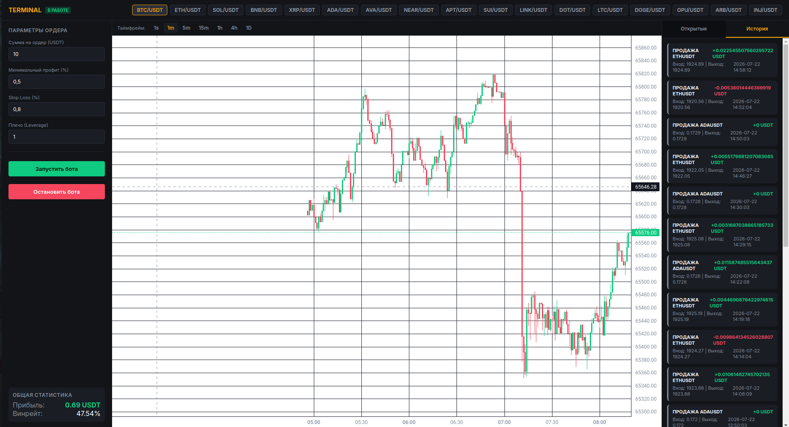

# NeuroTrader

> Автоматизированная торговая система на базе машинного обучения (XGBoost / CatBoost) с кастомным GUI-интерфейсом для Bybit.


---

## 📊 Интерфейс программы



---

## ✨ Основные возможности

* **ML-Прогнозирование:** Обучение модели на технических индикаторах (RSI, MACD, SMA, свечные паттерны TA-Lib)[cite: 1].
* **Мини-ИИ Ассистент (MiniAI):** Оценка волатильности рынка (ATR) и автоматический выбор оптимального таймфрейма (15m / 1h), контроль лимитов и рисков[cite: 1].
* **Интерактивный GUI:** Полноценный торговый терминал с графиками TradingView Lightweight Charts, реализацией управления ордерами и PnL-статистикой[cite: 2].
* **Paper Trading / Live Trading:** Безопасное тестирование стратегий на виртуальном счету перед реальной торговлей[cite: 1].
* **Поддержка множества пар:** Мониторинг популярной корзины альткоинов и BTC/ETH[cite: 1].

---

## 🛠 Технологический стек

* **Language:** Python 3.10+[cite: 1]
* **Machine Learning:** XGBoost, CatBoost, Scikit-learn[cite: 1]
* **Data Analysis:** Pandas, NumPy, TA-Lib[cite: 1]
* **API Integration:** Pybit (Bybit API)[cite: 1]
* **Frontend / GUI:** PyWebView, HTML5/CSS3, JavaScript, Lightweight Charts[cite: 2]

---

## 🚀 Быстрый запуск

1. **Клонировать репозиторий:**
   ```bash
   git clone [https://github.com/ВАШ_НИК/NeuroTrader.git](https://github.com/ВАШ_НИК/NeuroTrader.git)
   cd NeuroTrader
